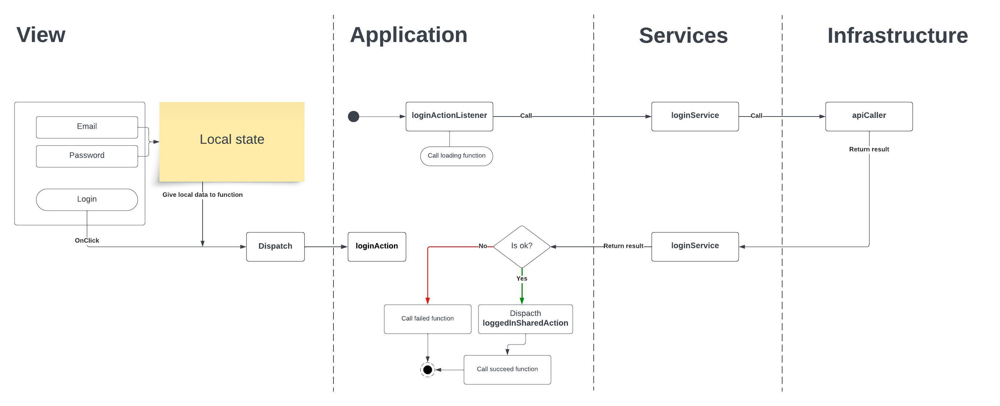

# Folders

#### application
It maintains the application logic.

#### infra
All the api and databases(localStorage, cookie etc.) get configured at the infrastructure folder. It aids the application to interact with external components to maintain the workflow and process data.

#### service
The service folder resides in the middle of the infra and other layer and functions as an intermediate between them.

# Figma design:
https://www.figma.com/file/pQanm1710o1f7pmqqna8HM/UI-Design-on-Login-Page-Sign-in%2FSign-up-(Community)?node-id=0%3A1&mode=dev